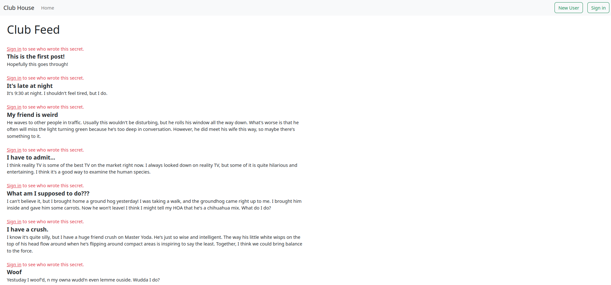
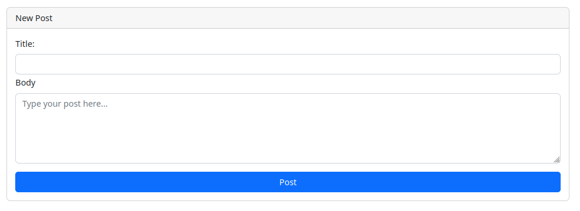
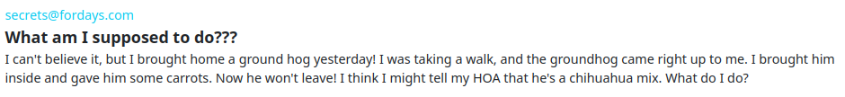
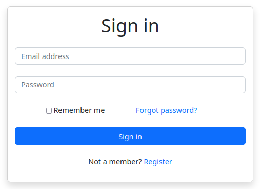
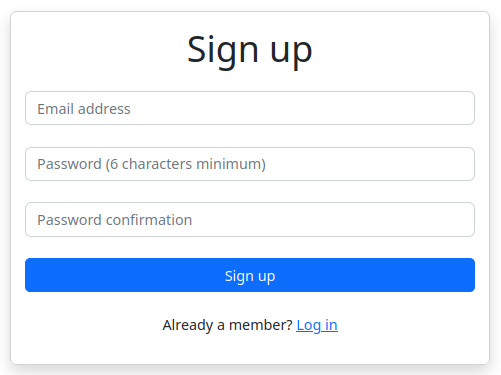

# Members Only!

This project was created to practice <strong>authenticating users</strong> using <strong>Devise</strong> while also practicing <strong>CRUD</strong> actions.

### The Assignment From The Odin Project

"In this project, you’ll be building an exclusive clubhouse where your members can write anonymous posts. <strong>Inside the clubhouse, members can see who the author of a post is but, outside, they can only see the story and wonder who wrote it</strong>."

### Functionality

* Logged in users can create their own posts
* The author of each post is <strong>hidden</strong> unless the user is <strong>authenticated</strong> and logged in.
* User sessions (log in and out) handled with <strong>Devise</strong>
* User registration (sign up) handled with <strong>Devise</strong>
* <strong>Bootstrap</strong> used for styling

### Screenshots

  <figure>
    <figcaption>Home Page (posts#index)</figcaption>
    
  </figure>
  <figure>
    <figcaption>New Post View</figcaption>
    
  </figure>
  <figure>
    <figcaption>Secret Poster Revealed After Loggin In</figcaption>
    
  </figure>
  <figure>
    <figcaption>Log In View</figcaption>
    
  </figure>
  <figure>
    <figcaption>Sign Up View</figcaption>
    
  </figure>

